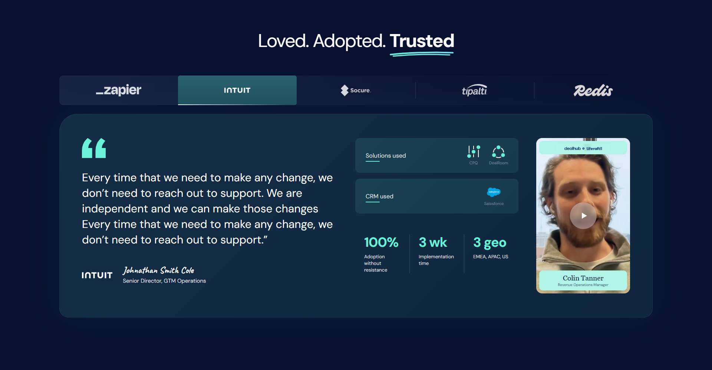
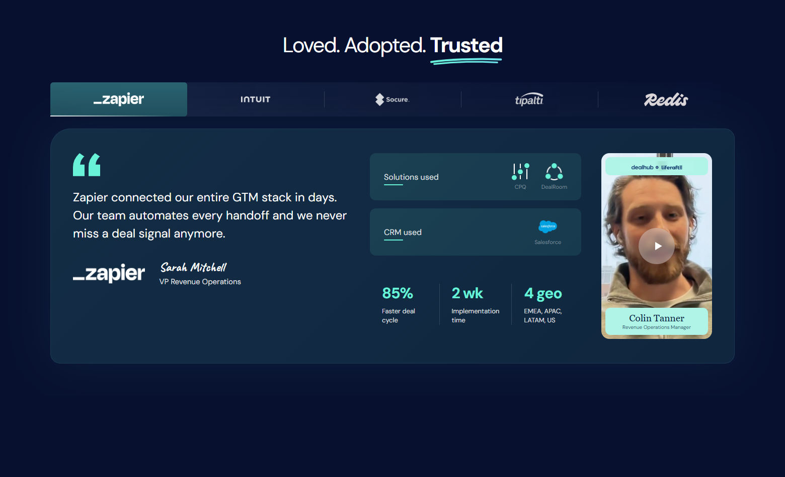

# Case Study Tabs — Custom WordPress Theme

A responsive "Case Study Tabs" section implemented from a Figma design as a custom WordPress theme, with a fully manageable **ACF Pro Gutenberg block**. The block is placed on the site's homepage.



## Features

- **Custom theme from scratch** — no starter theme, minimal and clean.
- **ACF Gutenberg block** (`Case Study Tabs`) — every piece of content is editable from the admin:
  - Section title + highlighted word (brush underline)
  - Tabs repeater — add / remove / reorder companies; each tab manages its logo, quote, author (signature + role), Case Study link, solutions list (icon + label), CRM, up to 3 stats, and a video (file, poster, brand strip, person name & role)
- **Responsive workflow** for the three main screens — **1920** (wide), **1560** (laptop), **640** (mobile) — plus tidy in-between behavior.
- **Mobile slider** — the whole tab section is draggable/touchable as a single slide (scroll-snap); swiping a panel syncs the active tab and vice versa.
- **Video states** — poster with play overlay (16:10), expands to portrait 9:16 while playing with the brand strip and speaker credit fading in.
- **Vanilla JS** (no jQuery), WAI-ARIA tabs pattern with keyboard navigation.
- **SCSS source** with an npm build pipeline; compiled CSS committed.
- **Self-hosted fonts** — DM Sans, Caveat, DM Serif Display (woff2, latin subset).
- ACF field group versioned as **local JSON** (`acf-json/`) — synced with the codebase, no manual DB imports.

| Laptop 1560 | Mobile | Mobile — video playing |
| --- | --- | --- |
|  |  |  |

## Running the site

1. Install [Local](https://localwp.com/).
2. In Local: **Import site** (or drag & drop) → select `case-study-tabs-export.zip` from this repository.
3. Start the site and open the homepage.

## WP Admin

| | |
| --- | --- |
| URL | `http://case-study-tabs.local/wp-admin` |
| Username | `admin` |
| Password | `Admin!2026#Task` |

Edit the homepage (Pages → Home) to manage all block fields.

## Theme development

```bash
cd wp-content/themes/case-study-theme
npm install
npm run build   # compile SCSS -> assets/css/main.css
npm run watch   # compile on change
```

## Theme structure

```
case-study-theme/
├── acf-json/                  # ACF field group (local JSON)
├── assets/
│   ├── css/main.css           # compiled stylesheet
│   ├── fonts/                 # self-hosted woff2
│   └── js/case-study-tabs.js  # block behavior (tabs, slider, video)
├── blocks/
│   └── case-study-tabs/
│       ├── block.json         # block registration metadata
│       └── render.php         # server-side render template
├── src/scss/                  # SCSS source
├── functions.php              # setup, assets, block + ACF JSON registration
├── header.php / footer.php / index.php
└── style.css                  # theme header
```
